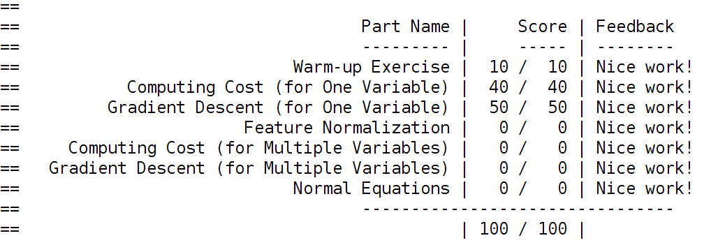
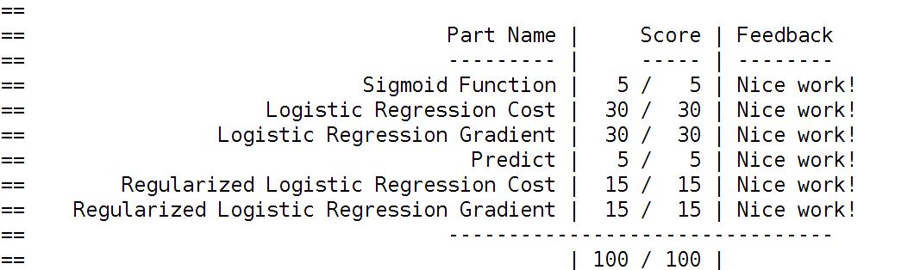
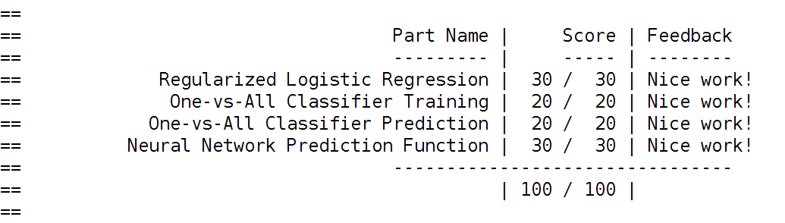
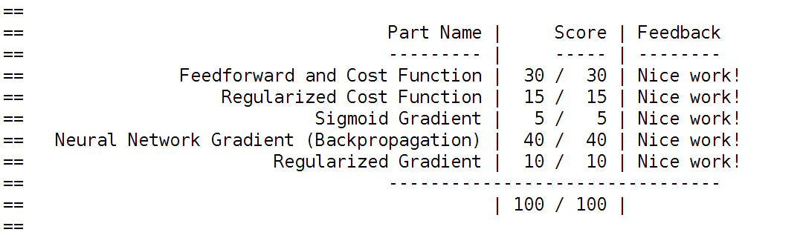
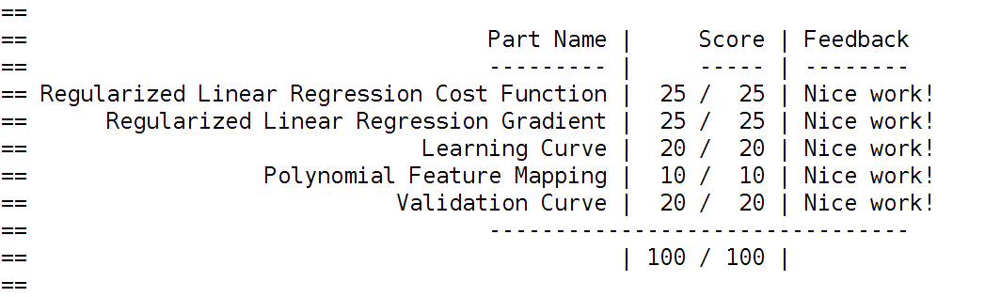
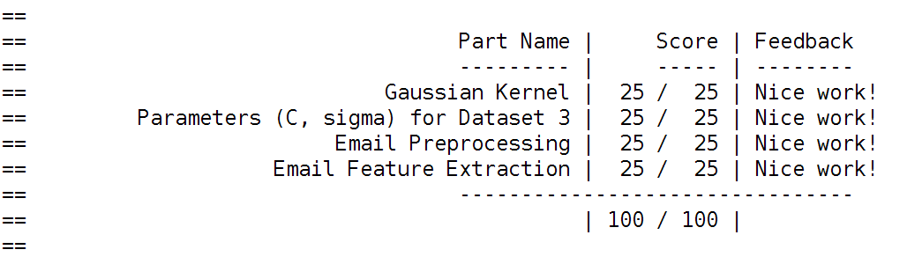
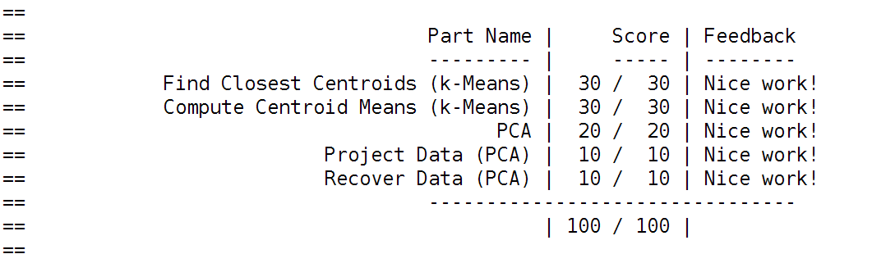
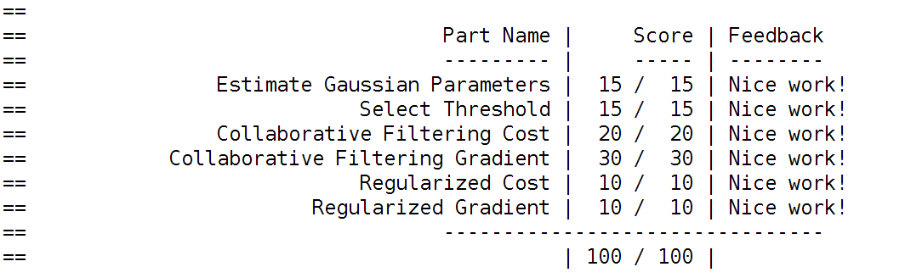

# Machine-Learning-coursera-exercises
Machine Learning class (Stanford - coursera) programming assignments

Week 2 assignment

Week 3 assignment

Week 4 assignment

Week 5 assignment

Week 6 assignment

Week 7 assignment

Week 8 assignment

Week 9 assignment

